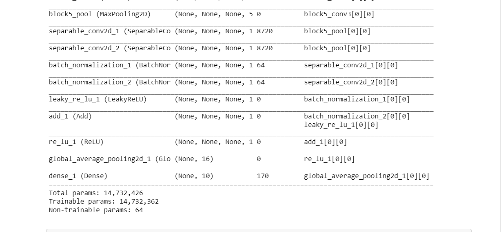
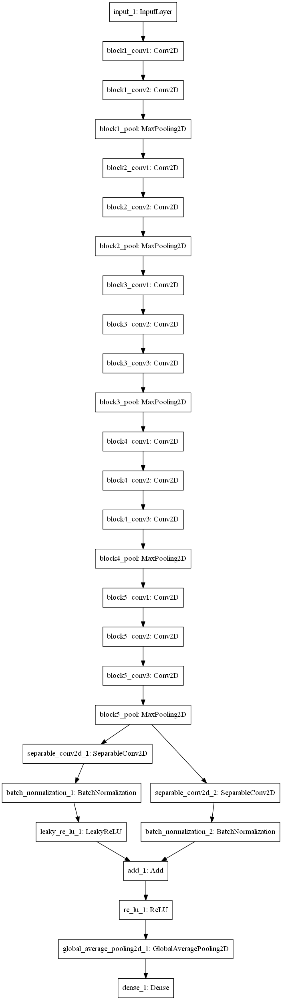

# Object_Classification_Deep_Residual_Seperable_CNN_with_base_model_VGG16
Object Classification using Resnet50 Network on cifar10 datasets from keras.  
The Network Used is Resnet50 as the base model.  The images were imported from keras.datsets containing about 50000 training imaages with 10000 testing images.  
The model was created with VGG16 as its base model and a Residual Seperable Convolutional layer following it.  
The optimzer was Adam, 50 epochs with batch size of 16 and early stopping with patience of 10 and lr_reduce with factor of 0.1 and     patience of 2 were applied to the network.  
The training set was split into validation set and tgraining set itself with a validation split = 0.1  
The link of the Model -https://drive.google.com/open?id=1KOcHe3aDXZqz6UHUAdks5Y9WtaObB9Nc
# The code explanation.
The first Cell Includes all the import for the creation of the model.  
It also includes the import of the cifar10 datsets from keras.datsets.  
In the next cell I load the data into training and testing sets for the model creation and training.  
def residual_block(mod_, f_in, f_out, strides_ = (1,1), use_shortcut_ = False):   \n",  
    "    shortcut_ = mod_\n",  
    "    \n",  
    "    mod_ = SeparableConv2D(f_in, (1,1), strides=(1,1), padding = \"same\")(mod_)\n",  
    "    mod_ = BatchNormalization()(mod_)\n",  
    "    mod_ = LeakyReLU()(mod_)\n",  
    "    if use_shortcut_ == True or strides_ != (1,1):\n",  
    "        shortcut_ = SeparableConv2D(f_out, (1,1), strides=strides_, padding = \"same\")(shortcut_)\n",  
    "        shortcut_ = BatchNormalization()(shortcut_)\n",  
    "        \n",  
    "    mod_ = Add()([shortcut_, mod_])\n",  
    "    mod_ = ReLU()(mod_)\n",  
    "    \n",  
    "    return mod_"  
 The above code is for Generating the Residual block used after the VGG16 base model represented as follows:  
 "def model_build():\n",  
 "    base_model = VGG16(weights = None, include_top = False)\n",  
    "    x = base_model.output\n",  
    "    x = residual_block(x, 16,16, use_shortcut_ = True)\n",  
    "    x = GlobalAveragePooling2D()(x)\n",  
    "    pred = Dense(10, activation = \"softmax\")(x)\n",  
    "    model_imagenet = Model(input=base_model.input, output = pred)\n",  
    "    return model_imagenet"  
 This is the model that we trained on the cifar datasets. 
 As one can see the base model is the predefined renet50 model pretrained with imagenet dataset.
# The Dataset is as follows
Datasets - from keras.datasets import cifar10  
(x_train, y_train), (x_test, y_test) = cifar10.load_data()  
# The model Summary
"model_imagenet=model_build()\n",  
"model_imagenet.compile(loss='binary_crossentropy', optimizer=Adam(), metrics=['accuracy'])\n",  
"model_imagenet.summary()"    
This gives us the model summary containing 14,732,426 parameters with 14,732,362 as trainable parameters and rest as non trainable parameters.  

# The Model Image

# Training Model
"resnet_val_hist = model_resnet.fit(X_train, y_train, epochs = nepoch, batch_size=batch_size, callbacks = [lr_reduce, checkpoint, earlyStopping], validation_split = 0.1, verbose = 2)"  
The batch size is 16  and the epochs are 50 with early stopping of  patience 10.  
# Results
The Training accuracy was 98.40.  
The testing acuuracy was 96.10  
